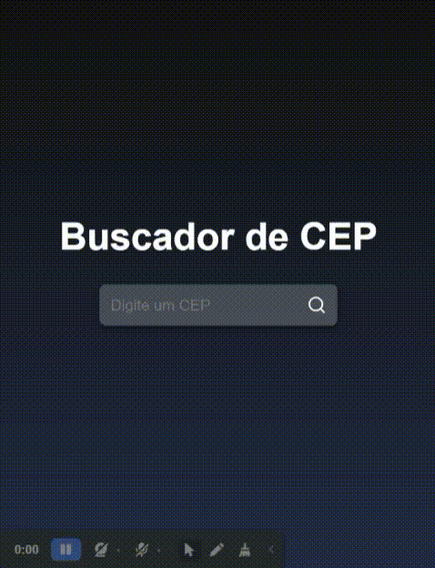

<h1 align='center'>Buscador</h1>

<p>Buscador is an address search project by Brazilian zip code. In this app I am using React, JavaScript, HTML5, CSS3 and SweetAlert2.</p>

## Features Developed

- [x] Search button animation
- [x] Animation when loading or reloading the page
- [x] Responsivity

## Interface

 

## Starting the Application

<p>1. After cloning the project</p>

```bash
cd buscador
```

<p>2. In the buscador repository we need to install the dependencies</p>

```bash
npm install
```

<p>3. And finally we can run the application</p>

```bash
npm start
```

## Technologies


## Services Used


## Deploy

You can access the project by clicking the button below.

<a href="https://buscador-seven.vercel.app/" target='_blank'></a>
